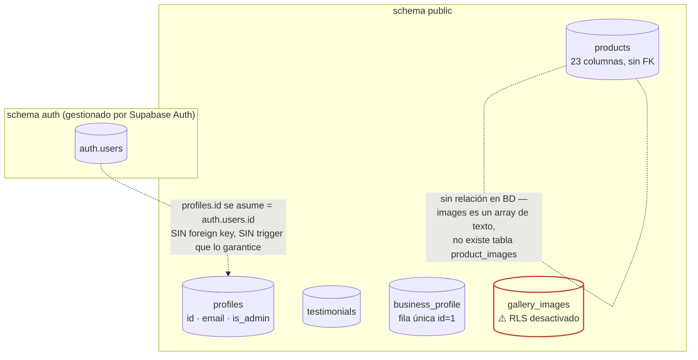

# Auditoría de Supabase — SISTETECNI Catalog

**Estado:** FASE 0 (descubrimiento) cerrada. FASE 0.1 (seguridad y saneamiento) — **diagnóstico y propuesta listos, nada ejecutado todavía.**
**Fuente de verdad:** resultado real de `docs/fase0-descubrimiento-export.sql`, ejecutado manualmente en Supabase SQL Editor el **2026-08-13T00:56:17Z**. Todo lo de este documento se basa en ese JSON, no en inferencias del código — donde algo no pudo confirmarse con el JSON, se dice explícitamente.
**Nada fue modificado en Supabase.** No se ejecutó SQL, no se cambiaron policies, no se tocó el esquema de `products`, no se eliminó ninguna columna.

---

## 1. Esquema confirmado

5 tablas en `public`, todas con PK propia (`id`), **ninguna con foreign key** (`foreign_keys: []` en el resultado — confirmado, no inferido). `triggers: []` y `funciones: []` también vacíos: **no existe ningún trigger ni función en el schema `public`** de este proyecto.

| Tabla | PK | RLS activado | Columnas |
|---|---|---|---|
| `products` | `id` (uuid, `gen_random_uuid()`) | ✅ Sí | 23 |
| `business_profile` | `id` (integer) | ✅ Sí | 15 |
| `testimonials` | `id` (uuid, `gen_random_uuid()`) | ✅ Sí | 8 |
| `profiles` | `id` (uuid, sin default) | ✅ Sí | 4 |
| `gallery_images` | `id` (integer, `nextval` sequence) | ❌ **No** | 6 |

`products.erp_id` tiene constraint `UNIQUE` (`products_erp_id_key`) además de un índice manual (`idx_products_erp_id`) — redundante pero inofensivo, el índice único ya cubre la búsqueda.

## 2. Diagrama de relaciones (real, no inferido)

**No hay ninguna foreign key en la base.** Las 5 tablas son independientes entre sí a nivel de constraint. La única relación que existe es *implícita, por convención en el código de la aplicación*, no forzada por la base de datos:



**Nota importante sobre `product_images`:** esa tabla **no existe**. Las imágenes de un producto viven como un `text[]` (columna `products.images`) con URLs públicas de Supabase Storage — no hay tabla relacional de imágenes ni FK hacia `products`.

**Nota sobre `profiles` ↔ `auth.users`:** no hay FK, no hay trigger `on_auth_user_created` ni equivalente (`triggers: []` confirma que no existe ninguno). Esto significa que **crear un admin nuevo es 100% manual**: hay que crear el usuario en Supabase Auth y además insertar su fila en `profiles` con `is_admin = true` a mano — nada lo hace automáticamente. No es una vulnerabilidad, pero si algún día se agrega registro público de usuarios, cada cuenta nueva quedará sin fila en `profiles` hasta que alguien la cree (lo cual, correctamente, hace que `isAdmin()` devuelva `false` por defecto — falla de forma segura).

## 3. Tablas utilizadas por la web (cruce con el código real del repo)

| Tabla | ¿La usa `src/supabase/db.ts`? | Cómo |
|---|---|---|
| `products` | Sí | CRUD completo (catálogo público + panel admin) |
| `business_profile` | Sí | Lectura pública (fila `id=1`) + escritura admin |
| `testimonials` | Sí | Lectura pública + CRUD admin |
| `gallery_images` | Sí | Lectura pública + CRUD admin (borrado = `activa=false`) |
| `profiles` | Sí | Solo lectura de `is_admin`, nunca se escribe desde el código de la web |

No existe ninguna tabla `product_images` ni ninguna tabla más allá de estas 5 — confirmado por el descubrimiento real, no solo por el código.

## 4. RLS por tabla (real)

| Tabla | `rls_activado` | `rls_forzado` |
|---|---|---|
| `products` | ✅ true | false |
| `business_profile` | ✅ true | false |
| `testimonials` | ✅ true | false |
| `profiles` | ✅ true | false |
| `gallery_images` | ❌ **false** | false |

`rls_forzado` (`FORCE ROW LEVEL SECURITY`) está en `false` en todas — irrelevante en la práctica porque nadie está conectando como *owner* de las tablas desde la app (eso es lo que `FORCE` controla), pero se documenta por completitud.

## 5. Policies (reales, texto exacto capturado)

### `products`

| Policy | Roles | Comando | USING | WITH CHECK |
|---|---|---|---|---|
| `products public read` | `public` | SELECT | `true` | — |
| `products admin write` | `authenticated` | ALL | `EXISTS(profiles.id=auth.uid() AND is_admin=true)` | igual |
| **`service_role full access`** | **`public`** ⚠️ | ALL | `true` | `true` |

### `business_profile`

| Policy | Roles | Comando | USING | WITH CHECK |
|---|---|---|---|---|
| `business_profile public read` | `public` | SELECT | `true` | — |
| `business_profile admin write` | `authenticated` | ALL | `EXISTS(...is_admin=true)` | igual |

### `testimonials`

| Policy | Roles | Comando | USING | WITH CHECK |
|---|---|---|---|---|
| `testimonials public read` | `public` | SELECT | `true` | — |
| `testimonials admin write` | `authenticated` | ALL | `EXISTS(...is_admin=true)` | igual |

### `profiles`

| Policy | Roles | Comando | USING |
|---|---|---|---|
| `profiles read own` | `authenticated` | SELECT | `id = auth.uid()` |
| `read own profile` | `authenticated` | SELECT | `auth.uid() = id` |

Sin ninguna policy de INSERT/UPDATE/DELETE → con RLS activado, eso significa **denegado por defecto** para cualquier escritura desde `anon`/`authenticated`. Correcto.

### `gallery_images`

**Cero policies.** RLS desactivado (§4) — la ausencia de policies aquí no protege nada, porque RLS ni siquiera está activo.

## 6. Sistema administrativo

- **Autenticación:** Supabase Auth, email/password (`supabase.auth.signInWithPassword`).
- **Sesión:** JWT de Supabase Auth estándar, manejada por `@supabase/supabase-js` en el navegador.
- **Tabla de rol:** `profiles`, columna `is_admin boolean default false`. Sin FK hacia `auth.users` (§2).
- **Validación de rol:** `src/supabase/auth.ts::isAdmin()` — lee `profiles.is_admin` para `auth.uid()` actual.
- **Protección de rutas:** `ProtectedAdmin.tsx` (cliente) — redirige si no hay sesión o si `is_admin !== true`. **Esto es UX, no seguridad.**
- **Protección real en Supabase:** las policies `*_admin write` de `products`, `business_profile`, `testimonials` (§5) — correctas en su diseño (exigen `is_admin=true`), **pero en `products` quedan anuladas en la práctica por la policy `service_role full access`** (§8, CRÍTICA #1).
- **¿Puede alguien llamar a Supabase directo, sin el panel?** **Sí, confirmado, no es hipotético.** Con la clave anónima pública (visible en el bundle JS de cualquier página) y sin ninguna sesión, un `fetch`/`supabase-js` directo puede hoy insertar, modificar o borrar filas de `products` y de `gallery_images` — ver §8.

## 7. Storage

| Bucket | Público | `file_size_limit` | `allowed_mime_types` | Policies propias en `storage.objects` |
|---|---|---|---|---|
| `products` | ✅ true | *(sin límite)* | *(sin restricción)* | 4 — INSERT/SELECT/UPDATE/DELETE, rol `authenticated`, sin chequeo de `is_admin` |
| `gallery` | ✅ true | *(sin límite)* | *(sin restricción)* | **0** |
| `assets` | ✅ true | *(sin límite)* | *(sin restricción)* | **0** |
| `product-images` | ✅ true | *(sin límite)* | *(sin restricción)* | **0** |

`storage.objects` tiene RLS **activado** (`rls_activado: true`) — es una tabla única compartida por todos los buckets.

**Bucket huérfano detectado:** `product-images` no aparece referenciado en ningún archivo del código revisado en la Fase 0 (`src/supabase/storage.ts` solo usa `products`/`gallery`/`assets` por nombre, más `NEXT_PUBLIC_SUPABASE_BUCKET` como override). No se puede confirmar desde el repo si esa variable de entorno en Vercel apunta a `product-images` en vez de `products` — **necesito que lo confirmes tú**, revisando las variables de entorno del proyecto en Vercel.

**Límites de tamaño:** `file_size_limit` y `allowed_mime_types` están en `null` en los 4 buckets — es decir, **el límite de 1 MB para imágenes y 25 MB para video que existe en `src/supabase/storage.ts` es solo del navegador** (ya se había señalado en la Fase 0); confirmado ahora que no hay ningún límite espejo a nivel de bucket en Supabase.

### 7.1 ¿Puede un anónimo subir o borrar archivos?

**No, para el bucket `products`** — las 4 policies exigen rol `authenticated` (no `public`), así que el rol `anon` (sin sesión) no tiene ninguna policy permissive aplicable para INSERT/UPDATE/DELETE → denegado. Esta parte está mejor configurada que la tabla `products`.

**Pero sí puede cualquier usuario *autenticado*, sea o no administrador** — ver §8, ALTA #1.

**Para `gallery`, `assets` y `product-images`: no hay ninguna policy**, ni para `anon` ni para `authenticated`. Con RLS activado y cero policies aplicables, la vía autenticada de escritura (`.storage.from(bucket).upload(...)`) debería estar **denegada para todos** hoy — lo que probablemente rompe la subida de galería/logo/video del panel (ver §8, MEDIA).

La **lectura pública** de imágenes (`getPublicUrl`, usada en todo el catálogo) no pasa por estas policies en absoluto: los 4 buckets están marcados `publico: true`, y esa ruta de Storage sirve el archivo sin evaluar RLS. Confirmado: la lectura pública de imágenes seguirá funcionando exactamente igual pase lo que pase con las policies de escritura.

---

## 8. Vulnerabilidades encontradas (por severidad)

### 🔴 CRÍTICA #1 — `products`: la policy "service_role full access" abre INSERT/UPDATE/DELETE a cualquiera

- **Tabla:** `public.products`
- **Policy exacta:** `service_role full access` — `roles: ["public"]`, `cmd: ALL`, `using: true`, `with_check: true`
- **Qué permite hoy:** en Postgres, cuando el campo `roles` de una policy contiene `public`, la policy **se aplica a cualquier rol**, no solo al que su nombre sugiere. `public` no es un alias de `service_role`: es el pseudo-rol que Postgres usa quen no se restringe a ningún rol — cubre `anon`, `authenticated` y también `service_role` (aunque a `service_role` ni le hace falta, ver más abajo). Las policies *permissive* (el tipo por defecto, y no hay evidencia de ninguna *restrictive* en este esquema) se combinan entre sí con **OR**: para autorizar una operación basta con que **una sola** policy aplicable la permita, sin importar cuántas otras policies más estrictas existan también para ese mismo comando. Como `with_check: true` autoriza cualquier INSERT/UPDATE y `using: true` autoriza cualquier DELETE/lectura, esta policy por sí sola anula en la práctica la protección de `products admin write` (que si exige `is_admin=true`, pero da igual: con que UNA policy diga que sí, ya alcanza).
- **Interacción GRANT + RLS (explicación, no asumida):** una policy RLS solo entra en juego si el rol ya tiene el privilegio SQL base (`GRANT SELECT/INSERT/UPDATE/DELETE`) sobre la tabla — RLS restringe filas, no sustituye al GRANT. Supabase, en la configuración estándar de cualquier proyecto nuevo, otorga esos 4 privilegios sobre las tablas de `public` a los roles `anon` y `authenticated` **por defecto**, precisamente para que RLS sea la única capa de control necesaria (documentado como comportamiento estándar de Supabase). Este descubrimiento no capturó `information_schema.role_table_grants` directamente (no estaba en el script), así que no puedo mostrarte la fila exacta del GRANT — pero la evidencia indirecta es sólida: la policy `products public read` (rol `public`, SELECT) es la que hace funcionar el catálogo público hoy, lo cual **solo es posible si `anon` efectivamente tiene el GRANT de SELECT** — y Supabase normalmente otorga los 4 privilegios juntos, no por separado, así que lo más razonable es asumir que `anon`/`authenticated` también tienen INSERT/UPDATE/DELETE a nivel SQL sobre `products`, salvo que alguien haya hecho un `REVOKE` explícito — de lo cual no hay ningún rastro en esta auditoría ni en las migraciones del repo. **Si quieres eliminar esta duda al 100 % antes de aplicar cualquier corrección, puedo darte una consulta adicional de solo lectura sobre `information_schema.role_table_grants` — dímelo y te la preparo.**
- **Quién puede aprovecharla:** cualquier visitante del sitio, usando la misma clave anónima pública que ya viaja en el JS de cualquier página — sin login, sin cuenta, sin pasar por `/admin`.
- **Impacto:** control total de `products` desde fuera del panel — crear productos falsos, poner cualquier precio, cambiar `stock`, alternar `visible_web`, o vaciar el catálogo completo.
- **Corrección:** `DROP POLICY "service_role full access"` (Bloque A del SQL propuesto). No hace falta recrearla apuntando a `service_role`: ese rol tiene `BYPASSRLS` en Supabase — ignora RLS en toda tabla, con o sin policy. Una policy para `service_role` nunca sirve para nada.

### 🔴 CRÍTICA #2 — `gallery_images`: RLS completamente desactivado

- **Tabla/bucket:** `public.gallery_images`
- **Configuración exacta:** `rls_activado: false`. Cero policies (ni una).
- **Qué permite hoy:** con RLS desactivado en Postgres, no hay ningún filtro por fila ni por operación — cualquier rol con el GRANT base (de nuevo, `anon`/`authenticated` por defecto en Supabase) tiene acceso irrestricto a INSERT/UPDATE/DELETE/SELECT.
- **Quién puede aprovecharla:** cualquier visitante anónimo, sin sesión.
- **Impacto:** inyectar imágenes arbitrarias en la galería pública del sitio, borrar todas las filas, o alterar `orden`/`caption` a voluntad.
- **Corrección:** `ALTER TABLE ... ENABLE ROW LEVEL SECURITY` + las 2 policies estándar (lectura pública, escritura admin) — Bloque B del SQL propuesto.

### 🟠 ALTA #1 — `storage.objects`, bucket `products`: escritura abierta a cualquier autenticado, no solo admins

- **Tabla/bucket:** `storage.objects`, filtrado por `bucket_id = 'products'`
- **Policies exactas:** 4 policies (`1ifhysk_0..3`), roles `["authenticated"]`, comandos INSERT/SELECT/UPDATE/DELETE, condición única `bucket_id = 'products'` — **sin ninguna verificación de `is_admin`**.
- **Qué permite hoy:** cualquier cuenta autenticada (no solo el/los admins configurados en `profiles`) puede subir, sobrescribir o borrar archivos del bucket.
- **Quién puede aprovecharla:** cualquiera que consiga una sesión autenticada. No pude confirmar desde este descubrimiento si el registro público de cuentas está habilitado en tu proyecto (Authentication → Providers/Settings de Supabase, fuera del alcance de este script) — **si lo está**, esto es tan grave como si fuera anónimo, porque cualquiera puede autocrearse una cuenta vía la API de Auth sin pasar por ningún formulario del sitio.
- **Impacto:** subir archivos no autorizados a un bucket público, sobrescribir imágenes reales de productos, o borrarlas.
- **Corrección:** restringir INSERT/UPDATE/DELETE con el mismo chequeo `is_admin` que ya usan las tablas, dejando la policy de SELECT intacta (lectura ya es pública por el bucket). Bloque C del SQL propuesto.

### 🟡 MEDIA #1 — buckets `gallery` y `assets` sin ninguna policy: probable funcionalidad rota, no solo riesgo

- Con RLS activado en `storage.objects` (global a todos los buckets) y **cero** policies para `bucket_id in ('gallery','assets')`, la vía autenticada de subida (`uploadGalleryImage`, `uploadAssetFile` en `src/supabase/storage.ts`, usadas por `/admin/galeria`, `/admin/configuracion` y `/admin/media`) debería estar **fallando en producción ahora mismo**. No es un hueco de seguridad — al contrario, falla cerrado — pero si es así, es una funcionalidad del panel rota que vale la pena confirmar cuanto antes.
- **Recomiendo:** antes de tocar nada, entra al panel y prueba subir una imagen de galería y un logo. Si falla, el Bloque D del SQL propuesto lo resuelve. Si funciona, hay algo (otra policy, otro mecanismo) que este descubrimiento no capturó, y conviene investigarlo antes de aplicar el bloque D.

### 🟡 MEDIA #2 — bucket `product-images` huérfano

- Existe, es público, no tiene policies, y no aparece referenciado en el código conocido del repo. Podría ser un resto de una migración anterior, o el bucket realmente activo si `NEXT_PUBLIC_SUPABASE_BUCKET` en Vercel apunta ahí en vez de a `products`. **Necesito que confirmes el valor real de esa variable en Vercel** para saber si aplica alguna corrección aquí también.

### 🟢 BAJA #1 — `profiles`: dos policies redundantes

- `profiles read own` y `read own profile` hacen exactamente lo mismo (`id = auth.uid()` vs `auth.uid() = id`). No es un riesgo — ambas son igual de restrictivas — pero es la misma señal de "cambios aplicados sin limpiar lo anterior" que ya se ve en `products` (columnas duplicadas, §11) y en `gallery_images` (migración del repo que nunca llegó a producción). Bloque E del SQL propuesto, sin urgencia.

### 🟢 BAJA #2 — `products.updated_at` sin trigger

- La columna existe (`timestamptz`, default `now()`), pero como `triggers: []` confirma que no hay ningún trigger `BEFORE UPDATE` en toda la base, `updated_at` solo se establece una vez al crear la fila y nunca se refresca. No es una vulnerabilidad, es un campo que hoy no cumple lo que su nombre promete.

### 🟢 BAJA #3 — Cero foreign keys en todo el esquema

- Ninguna relación entre tablas está forzada por la base de datos (§2), incluida `profiles.id` ↔ `auth.users.id`. No es explotable directamente, pero significa que la integridad referencial depende 100 % de la disciplina del código de aplicación — nada impide, a nivel de base, insertar una fila en `profiles` con un `id` que no corresponda a ningún usuario real de Auth.

---

## 9. Qué está correctamente protegido

- **`business_profile`** — lectura pública + escritura `is_admin` correctamente separadas, sin anomalías.
- **`testimonials`** — mismo patrón, sin anomalías. Ningún "service_role full access" equivalente aquí.
- **`profiles`** — sin lectura pública, cada quien lee solo su propia fila, **sin ninguna policy de escritura** → con RLS activado, eso es denegación por defecto: nadie puede auto-otorgarse `is_admin=true` vía API. Correcto (aunque redundante, §8 BAJA #1).
- **`products` — SELECT pública** — intencional y correcto, es lo que hace funcionar el catálogo.
- **Lectura de imágenes vía Storage** — pública por diseño en los 4 buckets, no depende de RLS, seguirá funcionando pase lo que pase con las correcciones propuestas.
- **`storage.objects` bucket `products`, escritura vs. `anon`** — bloqueada correctamente (exige `authenticated`, aunque falte el paso de `is_admin`, ver ALTA #1).

## 10. Recomendaciones

Ver **`docs/fase0.1-correccion-propuesta.sql`** — 5 bloques comentados (A–E), cada uno con su propio rollback usando los valores **reales** capturados en esta auditoría (no inventados). **No fue ejecutado.** Orden sugerido: A y B primero (críticas), C después (alta), D solo tras confirmar que está roto, E sin prisa.

## 11. Qué debe corregirse ANTES del personalizador

Sin excepción, **A y B son bloqueantes** para cualquier trabajo de "Personaliza tu portátil": ese proyecto va a añadir tablas nuevas (`upgrade_options`, `product_upgrade_options`, `quote_requests`) que dependen de que `products` sea confiable como fuente de precios — no tiene sentido construir un cálculo de precio "estimado" sobre una tabla que cualquiera puede alterar desde la consola del navegador ahora mismo. C es fuertemente recomendable también, porque el personalizador probablemente reutilizará imágenes del mismo bucket. D y E pueden esperar.

## 12. Diferencias entre lo inferido en la Fase 0 y lo confirmado ahora

| Punto | Se dijo en la Fase 0 (inferencia desde el código) | Confirmado ahora (dato real) |
|---|---|---|
| RLS de `products` | "No puedo confirmar si tiene RLS ni si está bien configurado" | RLS **sí** está activado, pero **anulado en la práctica** por una policy mal alcanzada — peor de lo que la inferencia hacía temer, y de una forma muy específica que no era adivinable desde el código. |
| RLS de `gallery_images` | El único `CREATE POLICY`/`ENABLE ROW LEVEL SECURITY` visible en el repo (`database/supabase-migrations.sql`) sugería que sí estaba protegida, aunque con una policy de escritura demasiado amplia (`authenticated`, no `is_admin`) | **RLS está desactivado y no existe ninguna policy** — la migración del repo **nunca se aplicó a producción**, o fue revertida después. La realidad es peor que lo que el propio archivo del repo prometía. |
| Columnas de `products` | Solo se conocían las 14 columnas que usa el código (`title, brand, model, cpu, ram, storage, screen, price, condition, stock, images, featured, visible_web, created_at`) | La tabla real tiene **23 columnas** — 9 adicionales nunca usadas por el código web: `erp_id`, `almacenamiento`, `procesador`, `marca`, `categoria`, `descripcion`, `estado`, `updated_at` (ver matriz §13.1). |
| Default de `visible_web` | La migración del repo dice `DEFAULT true` | El default real en producción es **`false`** — inconsistente con lo que el archivo del repo documenta (aunque sin efecto práctico, porque el formulario admin siempre envía un valor explícito). |
| Buckets de Storage | Se asumían 3: `products`, `gallery`, `assets` (los únicos nombrados en `src/supabase/storage.ts`) | Existe un **4º bucket, `product-images`**, no referenciado en el código conocido — origen sin confirmar. |
| Policies de escritura de `products` | Se advirtió "no puedo confirmar si un anónimo podría escribir — hay que verificarlo" | **Confirmado: sí puede.** No era una posibilidad teórica. |

## 13. Anexos pedidos

### 13.1 Matriz de columnas de `products` (real, cruzada con el código del repo)

| Campo | Leído por catálogo | Escrito por admin | Uso real | Canónico futuro |
|---|---|---|---|---|
| `title` | Sí | Sí | Activo | `title` — sin duplicado |
| `brand` | Sí | Sí | Activo | Candidato canónico (ver `marca`) |
| `marca` | No | No | **Huérfana, sin uso** | No usar todavía — ver nota abajo |
| `model` | Sí | Sí | Activo | `model` — sin duplicado |
| `cpu` | Sí | Sí | Activo | Candidato canónico (ver `procesador`) |
| `procesador` | No | No | **Huérfana, sin uso** | No usar todavía |
| `ram` | Sí | Sí | Activo | `ram` — sin duplicado |
| `storage` | Sí | Sí | Activo | Candidato canónico (ver `almacenamiento`) |
| `almacenamiento` | No | No | **Huérfana, sin uso** | No usar todavía |
| `screen` | Sí (solo detalle, no en listado) | Sí | Activo | `screen` — sin duplicado |
| `price` | Sí | Sí | Activo | `price` — sin duplicado |
| `condition` | Sí | Sí | Activo | Ver nota sobre `estado` abajo |
| `stock` | Sí | Sí | Activo | `stock` — sin duplicado |
| `images` | Sí | Sí | Activo | `images` — sin duplicado (no hay tabla `product_images`) |
| `featured` | Sí | Sí | Activo | `featured` — sin duplicado |
| `erp_id` | No | No | **Reservada, sin uso web** | Evaluar cuando exista integración real con el ERP; ya tiene `UNIQUE` |
| `visible_web` | Sí (filtro de catálogo) | Sí | Activo | `visible_web` — sin duplicado |
| `categoria` | No | No | **Huérfana, sin uso** | Candidata a activarse (hoy el filtro de marca en `ProductFilters.tsx` está *hardcodeado*, no usa ninguna columna de categoría) |
| `descripcion` | No | No | **Huérfana, sin uso** | Candidata a activarse — hoy no hay descripción larga en `/product` |
| `estado` | No | No | **Huérfana, sin uso** | Aclarar con negocio: ¿duplica `condition` (Usado/Nuevo) o es otro concepto (activo/agotado/reservado)? |
| `updated_at` | No | No (nunca se escribe explícitamente, sin trigger) | **Presente pero inerte** | Necesitaría un trigger `BEFORE UPDATE` para ser útil |

**Duplicados reales identificados:** `brand`/`marca`, `cpu`/`procesador`, `storage`/`almacenamiento`. Los tres siguen el mismo patrón — versión en inglés activa y en uso por el código, versión en español presente en la tabla pero completamente huérfana (ni leída ni escrita por ningún archivo de `src/`).

**Lo que no puedo determinar y necesito que confirmes:** el patrón `marca/procesador/almacenamiento` + `categoria/descripcion/estado` + `erp_id` (7 columnas españolas, todas huérfanas, todas nullable) tiene toda la forma de haber sido añadido de una sola vez — probablemente pensando en una futura sincronización con un ERP externo que escribiría en español. **¿Existe hoy algún proceso (script, integración, Zapier, n8n, lo que sea) que ya escriba en esas columnas desde fuera de esta web?** Si existe, el canónico futuro podría terminar siendo el *español*, no el inglés — justo lo opuesto de lo que parece más obvio a primera vista. No lo voy a asumir en ningún sentido hasta que lo confirmes.

**Cómo migrar después sin romper producción (cuando decidas, no ahora):** el camino seguro es aditivo — nunca "cortar" primero. Por ejemplo, si se decide que `brand` es el canónico y `marca` se retira: (1) el formulario admin empieza a escribir en ambas columnas a la vez durante un periodo de transición: (2) se confirma, con datos reales de uso durante ese periodo, que nada externo depende de `marca`; (3) solo entonces se deja de escribir en `marca` y, más adelante todavía, se elimina la columna. Nunca se elimina una columna sin haber confirmado primero que nada la está leyendo — exactamente lo que este punto de la auditoría pide no hacer todavía.

### 13.2 Estrategia de rollback por cambio de policy

Cada bloque de `docs/fase0.1-correccion-propuesta.sql` trae su rollback comentado inmediatamente debajo, usando el **texto exacto** de la policy tal como existe hoy en producción (capturado en este JSON, no reconstruido de memoria):

| Bloque | Cambio propuesto | Rollback |
|---|---|---|
| A | `DROP POLICY "service_role full access"` en `products` | `CREATE POLICY` idéntica (`to public using(true) with check(true)`) — texto exacto en el archivo |
| B | `ENABLE RLS` + 2 policies nuevas en `gallery_images` | `DROP` de las 2 policies + `DISABLE RLS` — vuelve exactamente al estado real capturado |
| C | 3 `DROP POLICY` + 3 `CREATE POLICY` nuevas en `storage.objects` (bucket `products`) | `DROP` de las 3 nuevas + recrear las 3 originales con su nombre y condición exactos |
| D | 2 `CREATE POLICY` nuevas en `storage.objects` (buckets `gallery`/`assets`) | `DROP` de las 2 — vuelve a "sin policies", el estado real de hoy |
| E | `DROP POLICY "profiles read own"` | `CREATE POLICY` idéntica |

En todos los casos, el rollback es una operación de policies únicamente — nunca toca datos ni columnas, así que es reversible en segundos si algo se comporta distinto a lo esperado.

### 13.3 Pruebas a definir antes de aplicar cualquier corrección (diseño únicamente — nada ejecutado)

**Método recomendado — transacción con rollback garantizado dentro del propio SQL Editor**, para no depender de crear cuentas de prueba reales ni arriesgar escribir datos reales:

```sql
-- Patrón para CADA prueba: se simula el rol, se intenta la operación,
-- y se revierte SIEMPRE, incluso si la operación "tuvo éxito".
begin;
  set local role anon;              -- o: authenticated / con un uid de prueba
  -- set local request.jwt.claims = '{"sub":"<uuid-de-prueba>","role":"authenticated"}';
  -- ... aquí la operación a probar (select/insert/update/delete) ...
rollback;  -- SIEMPRE rollback, nunca commit — ninguna prueba deja huella
```

Casos a cubrir (ninguno ejecutado todavía, quedan definidos para cuando decidas aplicar las correcciones):

| # | Prueba | Rol a simular | Resultado esperado HOY (antes de corregir) | Resultado esperado DESPUÉS de A–C |
|---|---|---|---|---|
| 1 | Anónimo puede leer catálogo | `anon` | ✅ permite | ✅ sigue permitiendo (sin cambios) |
| 2 | Anónimo NO puede insertar producto | `anon` | ❌ **hoy SÍ puede** (CRÍTICA #1) | ✅ debe pasar a denegar |
| 3 | Anónimo NO puede modificar precio | `anon` | ❌ **hoy SÍ puede** | ✅ debe pasar a denegar |
| 4 | Anónimo NO puede eliminar producto | `anon` | ❌ **hoy SÍ puede** | ✅ debe pasar a denegar |
| 5 | Autenticado normal (`is_admin=false`) NO puede modificar producto | `authenticated`, uid sin fila admin en `profiles` | ❌ **hoy SÍ puede** (vía la misma policy de CRÍTICA #1) | ✅ debe pasar a denegar |
| 6 | Administrador SÍ puede modificar producto | `authenticated`, uid con `is_admin=true` en `profiles` | ✅ permite | ✅ debe seguir permitiendo |
| 7 | Público puede ver imágenes | sin sesión, vía URL pública de Storage | ✅ permite | ✅ sigue permitiendo (no depende de RLS) |
| 8 | Autenticado normal NO puede borrar imágenes del bucket `products` | `authenticated`, uid sin `is_admin` | ❌ **hoy SÍ puede** (ALTA #1) | ✅ debe pasar a denegar |
| 9 | Administrador SÍ puede gestionar imágenes | `authenticated`, uid con `is_admin=true` | ✅ permite | ✅ debe seguir permitiendo |
| 10 (extra) | Anónimo NO puede insertar/borrar en `gallery_images` | `anon` | ❌ **hoy SÍ puede** (CRÍTICA #2) | ✅ debe pasar a denegar |
| 11 (extra) | Lectura pública de `gallery_images` sigue funcionando | `anon`, solo SELECT | ✅ permite | ✅ debe seguir permitiendo |

Para las pruebas de Storage (7, 8, 9) el equivalente es simular la llamada a la API de Storage con distintos JWT (vía `curl`/Postman contra el endpoint de Storage, o desde la consola del navegador con `supabase.storage...`), ya que `set local role` en SQL Editor cubre las tablas pero no directamente las políticas evaluadas por la API REST de Storage — mismo principio, ejecución distinta. Puedo preparar los comandos exactos cuando llegue el momento de ejecutar esta fase, sin ejecutarlos yo.

---

*Fin de la Fase 0.1 — diagnóstico y propuesta. No se ejecutó SQL, no se modificó Supabase, no se tocó el esquema de `products`, no se eliminó ninguna columna. A la espera de que revises `docs/fase0.1-correccion-propuesta.sql` antes de que se aplique nada.*
