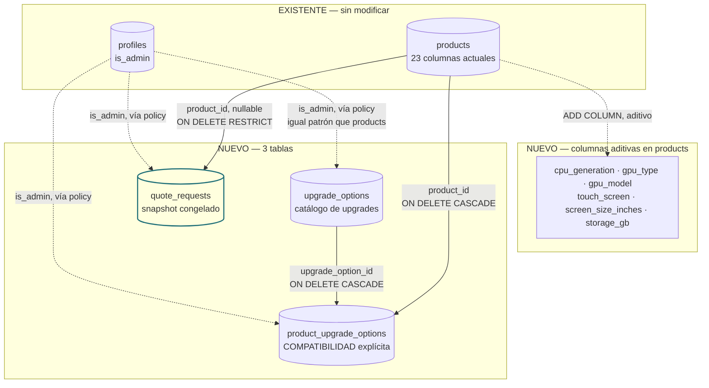
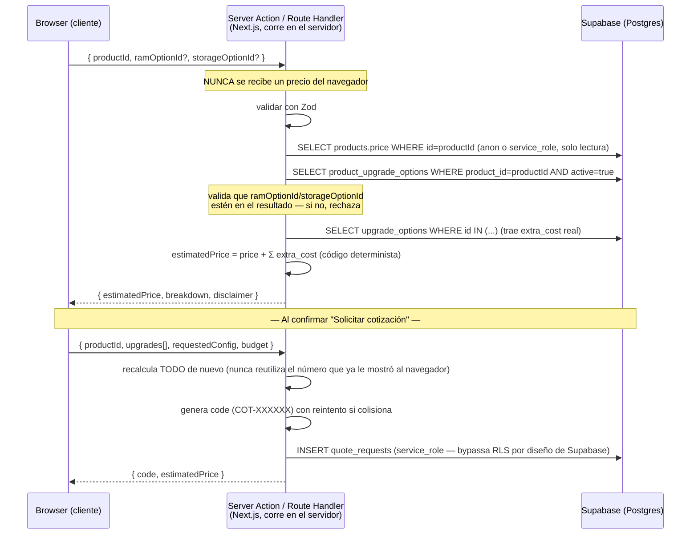

# Fase 2A — Diseño de "Personaliza tu portátil"

**Estado: DISEÑO. Nada implementado, nada ejecutado, nada desplegado.**
Este documento y `docs/fase2a-migracion-propuesta.sql` son el entregable completo de la Fase 2A. La Fase 2B (implementación) no empieza hasta autorización explícita.

**Recordatorio de estado pendiente:** la auditoría de seguridad (`docs/00-auditoria-supabase.md`) sigue **documentada y pendiente de corrección**. Nada de este diseño depende de que esas correcciones ya estén aplicadas para poder *diseñarse* — pero sí es un prerrequisito antes de que esta función reciba tráfico real en producción (§20).

**Las 14 decisiones (D1–D14) están CERRADAS** (detalle completo y razones en `docs/fase2a-decisiones-pendientes.md`). D11 se aprobó con **Opción A — proyecto Supabase de STAGING separado**; ver `docs/entornos-staging-produccion.md` para la estrategia de entornos y `supabase/migrations/` para las migraciones versionadas ya convertidas con estas decisiones aplicadas. **Fase 2A completamente cerrada — a la espera de autorización para iniciar la Fase 2B.**

---

## 1. Modelo de datos propuesto

Tres tablas nuevas + 6 columnas nuevas y aditivas en `products`. Nombres siguiendo la sugerencia del brief (no obligatorios, pero no encontré razón para cambiarlos):



SQL completo, comentado bloque por bloque, con rollback: **`docs/fase2a-migracion-propuesta.sql`**. No ejecutado.

## 2. Diagrama textual de relaciones

```
products (existente, 23 cols + 6 nuevas)
  │
  ├─ 1:N → product_upgrade_options.product_id   (ON DELETE CASCADE)
  │            └─ N:1 → upgrade_options.id       (ON DELETE CASCADE)
  │
  └─ 1:N → quote_requests.product_id  (nullable, ON DELETE RESTRICT)
              (si no hay producto base: is_special_request = true)

profiles (existente)
  └─ referenciado por policy (is_admin) en las 3 tablas nuevas
     — sin FK real, igual que ya ocurre hoy con products/testimonials

upgrade_options ←──┐
                    │ N:N vía product_upgrade_options
products ───────────┘
```

Sigue sin haber ninguna foreign key hacia `auth.users` (mismo hallazgo que en la Fase 0: `profiles.id` se asume igual a `auth.users.id` por convención, no por constraint).

## 3. Explicación de cada tabla/campo nuevo

### `upgrade_options` — catálogo de upgrades administrable

| Campo | Tipo | Por qué |
|---|---|---|
| `category` | `varchar(20)`, `CHECK IN ('ram','storage')` | Restringido a las 2 categorías reales del brief. Ampliable después con una migración, no lo dejo abierto ahora — evita sobrediseñar. |
| `label` | `text` | Lo que ve el cliente: "16 GB RAM". |
| `value` | `integer` | Capacidad resultante en GB — mismo criterio para RAM y almacenamiento, permite comparación numérica directa. |
| `interface` | `varchar(20)`, nullable | Solo aplica a `storage`: `SATA`/`NVMe`/`M.2 SATA`. Null para RAM. |
| `extra_cost` | `numeric`, `CHECK >= 0` | **El único campo que alimenta el cálculo de precio al cliente.** Es "precio final del upgrade" — ver §4 sobre por qué no se complica más. |
| `component_cost`, `install_cost` | `numeric`, nullable | Opcionales, solo para análisis interno de margen. **Nunca entran en el cálculo de precio al cliente.** |
| `active` | `boolean` | Activar/desactivar sin borrar (mismo patrón que `products.visible_web`). |

### `product_upgrade_options` — compatibilidad explícita (la pieza crítica)

Una fila = "este producto admite este upgrade". **Ausencia de fila = upgrade no disponible.** Nunca se infiere por categoría, marca o regla global — es justo lo que pide el brief ("NO quiero una regla global como 'todos los computadores pueden subir a 32 GB'"). `UNIQUE(product_id, upgrade_option_id)` evita duplicados. `note` permite documentar advertencias de instalación.

### `quote_requests` — solicitud de cotización con snapshot

| Campo | Tipo | Por qué |
|---|---|---|
| `code` | `text unique` | Identificador amigable no secuencial (§12). |
| `product_id` | `uuid`, nullable, `ON DELETE RESTRICT` | Nullable porque puede no haber match (`is_special_request=true`). `RESTRICT` en vez de `CASCADE`/`SET NULL`: no se puede borrar un producto con historial de cotizaciones — fuerza a usar `visible_web=false`, que ya es el patrón existente para "retirar" un producto sin perder historial. |
| `base_price_snapshot`, `base_config_snapshot` | `numeric`, `jsonb` | El precio y las specs del producto **en el momento exacto de la cotización** — nunca se vuelven a leer de `products` después. Esto es literalmente el requisito de snapshot del brief. |
| `requested_config` | `jsonb not null` | Lo que el cliente pidió — estructura libre, ver §13/§14 para su forma exacta según el flujo. |
| `selected_upgrades_snapshot` | `jsonb`, default `[]` | Cada upgrade elegido con su `extra_cost` ya congelado. JSONB confirmado sobre tabla hija — ver `docs/fase2a-decisiones-pendientes.md`, sección "Resuelto por análisis". |
| `estimated_price` | `numeric` | `base_price_snapshot + Σ(selected_upgrades_snapshot[].extra_cost)`, calculado server-side, nunca confiado del navegador. |
| `customer_city` | `text`, nullable | **(D5, aprobada)** único dato de contacto que se pide antes de WhatsApp, opcional. Deliberadamente **no** hay campo de nombre ni teléfono — WhatsApp ya los captura al abrir la conversación. |
| `status` | `text`, `CHECK` | **(D9, aprobada)** 7 estados: `nueva, en_revision, contactada, cotizada, aceptada, rechazada, expirada`. `'contactada'` se agregó para el momento en que el agente/vendedor ya escribió al cliente por WhatsApp. |
| `channel` | `text` | Hoy siempre `'web_personalizador'` — deja el campo listo para cuando exista un canal `'whatsapp'` directo. |
| `is_special_request` | `boolean` | Cubre el caso "no hay ningún producto base compatible, aún así quiero cotización" (§9, escenario I de la Fase 0) — y también el caso **(D7, aprobada)** de un producto identificado pero agotado, donde el cliente pide que le avisen. |

**Por qué esta tabla NO tiene policy de lectura pública** (a diferencia de `products`/`upgrade_options`): un `SELECT ... USING (true)` permitiría a cualquiera con la clave anónima listar los presupuestos y configuraciones de **todos** los clientes. El acceso de un cliente a su propia cotización pasa siempre por un Route Handler server-side que filtra por `code` exacto — nunca por una policy abierta. Ver §8.

## 4. Campos existentes de `products` que se reutilizan

`id, title, brand, model, cpu, ram, storage, screen, price, condition, stock, images, featured, visible_web` — exactamente el conjunto que la Fase 0 confirmó que usa el código real (`LIST_COLUMNS`, `mapProduct`, `cleanProductPayload` en `src/supabase/db.ts`). El personalizador se construye sobre este esquema real, no uno imaginado.

`ram` ya es `integer` — sirve tal cual para comparar contra `upgrade_options.value` en la categoría `ram`, sin necesidad de columna nueva.

## 5. Campos nuevos que necesita `products`, y por qué van ahí (no en otra tabla)

| Campo pedido en el brief | ¿Dónde va? | Justificación |
|---|---|---|
| Generación de CPU | **A. `products.cpu_generation`** | Filtro de equipo base (nunca upgrade). `cpu`/`procesador` son texto libre ("Intel Core i5-8250U") — no filtrable/ordenable de forma confiable. Se agrega un número estructurado *sin tocar* las columnas de texto existentes. |
| GPU dedicada | **A. `products.gpu_type` + `gpu_model`** | Filtro de equipo base — la GPU casi nunca es reemplazable en un portátil reacondicionado. |
| Touch | **A. `products.touch_screen`** | Filtro de equipo base — característica física del panel. |
| Tamaño de pantalla filtrable | **A. `products.screen_size_inches`** | Mismo problema que CPU: `screen` es texto libre. Se agrega el número, se conserva el texto para mostrar. |
| Almacenamiento comparable numéricamente | **A. `products.storage_gb`** | Necesario para poder comparar `storage_gb` del producto base contra `upgrade_options.value` — sin esto, todo el algoritmo de compatibilidad de almacenamiento sería imposible de calcular. |
| RAM máxima soportada | **C. NO se agrega columna — se deriva de `product_upgrade_options`** | La RAM máxima de un producto es, por definición, el `value` más alto entre sus `product_upgrade_options` activas de categoría `ram` (o su propio `ram` si no tiene ninguna). Agregar un `ram_max` en `products` duplicaría ese dato y podría desincronizarse de la tabla de compatibilidad real — la tabla de compatibilidad ya es la fuente de verdad, no hace falta una segunda. |
| Tipo de almacenamiento compatible (SATA/NVMe) | **C. `upgrade_options.interface`** | No es un atributo único por producto (un equipo podría admitir tanto reemplazo SATA como upgrade a NVMe) — es un atributo de cada *opción* de upgrade, no del producto base. |
| Duración de batería, peso/portabilidad | **Ninguna — no se agrega en 2A/2B** | El catálogo actual no rastrea esto y no hay forma confiable de inferirlo. Se documenta como limitación conocida (§13) en vez de inventar un valor. Es una decisión que necesita tu aprobación (§24, #2) si se quiere agregar más adelante. |

## 6. SQL/migración propuesta

**`supabase/migrations/`** — 4 migraciones versionadas (una por bloque: columnas de `products`, `upgrade_options`, `product_upgrade_options`, `quote_requests`), cada una con su rollback comentado. Es la fuente que se aplicará primero a STAGING y, después, a PRODUCTION — ver `supabase/migrations/README.md` y `docs/entornos-staging-produccion.md`. **`docs/fase2a-migracion-propuesta.sql` queda como documento de diseño/razonamiento, superseded por esa carpeta. Nada ejecutado en ningún entorno.**

## 7. Rollback propuesto

Incluido bloque por bloque en el propio archivo SQL. Resumen:

| Bloque | Rollback |
|---|---|
| 1 (columnas de `products`) | `DROP COLUMN` de las 6 — seguro mientras ninguna fila real las use todavía |
| 2 (`upgrade_options`) | `DROP TABLE` (las policies se eliminan automáticamente con la tabla, pero se listan explícitas por claridad) |
| 3 (`product_upgrade_options`) | `DROP TABLE` |
| 4 (`quote_requests`) | `DROP TRIGGER` + `DROP FUNCTION` + `DROP TABLE` |

Todo reversible en segundos, sin tocar `products` más allá de las 6 columnas aditivas.

## 8. Arquitectura: Browser → Next.js server → Supabase

Este es el cambio arquitectónico más grande del proyecto: hoy el 100% del código es `"use client"` hablando directo con Supabase (confirmado en la Fase 0 — cero Route Handlers, cero middleware). Para el personalizador, **precio, compatibilidad y persistencia de la cotización se mueven al servidor**, por mandato explícito del brief.



**Qué usa qué credencial:**

| Operación | Dónde corre | Credencial |
|---|---|---|
| Leer catálogo base / `upgrade_options` / `product_upgrade_options` para mostrar la UI | Cliente (`"use client"`, igual que hoy) | `NEXT_PUBLIC_SUPABASE_ANON_KEY` — estas tablas tienen SELECT público por diseño (§3) |
| Calcular precio, validar compatibilidad | Server Action | Lee `products`/`upgrade_options` — puede usar la anon key igual (son de lectura pública) o `service_role` si se prefiere no depender de RLS aquí; recomiendo anon key por simetría, ya que estas tablas son públicas de todos modos |
| Crear/leer `quote_requests` | Server Action / Route Handler | **`SUPABASE_SERVICE_ROLE_KEY`** — variable de entorno **server-only**, sin prefijo `NEXT_PUBLIC_`, nunca en código de cliente |
| CRUD de `upgrade_options`/`product_upgrade_options`/`quote_requests` desde el panel admin | Cliente, igual que hoy (`AdminProductForm` style) | anon key + sesión — protegido por la policy `is_admin` de cada tabla (una vez la Fase 0.1 esté corregida en `products`, este patrón ya es seguro para las tablas nuevas desde el día 1) |

Server Actions (`"use server"`) para los flujos de formulario del wizard (calcular, solicitar cotización) — se integran naturalmente con `useFormState`/hooks de React sin necesidad de un cliente `fetch` aparte. Un **Route Handler** (`app/api/cotizaciones/[code]/route.ts`) para la consulta por código, porque ese endpoint está pensado para ser llamado por sistemas externos más adelante (el agente local), no solo desde un componente React.

## 9. Algoritmo determinista para encontrar equipos base

Puro, sin llamadas a ningún LLM, reproducible con los mismos inputs.

**Entrada:** `RequirementProfile` — mismo shape venga del flujo A o B (§13/§14 explican cómo se construye en cada uno):

```ts
type RequirementProfile = {
  ramMin?: number;
  storageMin?: number;          // GB
  screenSizeRange?: [number, number];
  cpuGenerationMin?: number;
  brandPreferred?: string[];    // preferencia blanda, no obligatoria
  gpuDedicatedRequired?: boolean;
  touchRequired?: boolean;
  budgetMax?: number;
  priority?: 'precio' | 'rendimiento' | 'portabilidad' | 'pantalla' | 'almacenamiento';
};
```

**Paso 1 — Filtros duros** (consulta normal a `products`, extiende el patrón ya existente de `getProductsList`): `visible_web=true`, `cpu_generation >= cpuGenerationMin` (si se pidió), `gpu_type='dedicada'` (si `gpuDedicatedRequired`), `touch_screen=true` (si `touchRequired`). **`stock=0` NO se excluye aquí** — un equipo agotado sigue siendo candidato **(D7, aprobada)**: aparece en los resultados con badge "Agotado" y su CTA cambia de "Personalizar" a "Avísame cuando haya disponible" (genera una cotización con `is_special_request=true`, sin comprometer entrega inmediata). Esto da un conjunto de **candidatos base reales**.

**Paso 2 — Viabilidad de RAM/almacenamiento por candidato:**
```
ramAchievable(candidate) =
     candidate.ram >= ramMin
  OR existe product_upgrade_options activa para candidate
     con upgrade_option.category='ram' AND value >= ramMin

storageAchievable(candidate) = (mismo criterio, category='storage', storage_gb)
```
Si alguno de los dos no es alcanzable **ni siquiera con upgrade**, el candidato se descarta — este es el mecanismo concreto que impide ofrecer una configuración físicamente imposible (brief, sección "Compatibilidad"). Si es alcanzable vía upgrade, se calcula la **opción más barata que cumple el mínimo** (nunca se sobre-especifica un upgrade más caro de lo necesario).

**Paso 3 — Score** (fórmula inicial propuesta, ajustable en código sin costo — ver `docs/fase2a-decisiones-pendientes.md` D8, aprobada: el presupuesto es preferencia, no restricción dura, con tolerancia +15% solo hacia arriba):
```
score(candidate) =
    − |finalPrice − budgetMax| × 1.0         (más cerca del presupuesto, mejor; ver tolerancia abajo)
    + bonus_prioridad(candidate, priority)    (ej. +10 si priority='rendimiento' y cpu_generation es alta)
    − upgradesNecesarios.length × 5           (preferir match exacto sobre necesitar upgrades)
    − gbSobreprovisionado × 0.5               (no recomendar upgrades más grandes de lo pedido)
    + (brandPreferred?.includes(candidate.brand) ? 5 : 0)
```
Se ordenan de mayor a menor score, se muestran los **top 3**.

**Paso 4 — Relajación si no hay candidatos suficientes** (implementa "cuando no hay coincidencia", brief): se relajan restricciones en este orden fijo, una a la vez, repitiendo el Paso 1–3 tras cada relajación, hasta obtener al menos 1 resultado o agotar la lista:

1. Quitar preferencia de marca
2. Quitar exigencia de touch
3. Ampliar rango de pantalla ±1"
4. Quitar exigencia de GPU dedicada (solo si no era un requisito "duro" explícito del cliente, ej. gaming)
5. Reducir generación mínima de CPU en 1
6. Ampliar presupuesto hasta +15% **(D8, aprobada: tolerancia confirmada, solo hacia arriba — un resultado más barato que el presupuesto nunca se penaliza, y todo resultado que exceda el presupuesto se etiqueta explícitamente en la UI, ej. "$30.000 sobre tu presupuesto")**
7. Reducir el mínimo de RAM/almacenamiento (último recurso)

Cada relajación aplicada se registra (`{ tipo: 'quitar_marca', mensaje: '...' }`) para poder mostrarle al cliente **qué cambió**, no solo el resultado — cumple el requisito de transparencia del brief ("explicar brevemente qué cambia").

Si tras agotar la lista sigue sin haber candidatos → **cotización especial** (`is_special_request=true`, `product_id=null`), capturando igual el `requestedConfig` completo para seguimiento manual.

## 10. Algoritmo para calcular upgrades disponibles (por producto elegido)

Dado un `product_id` ya seleccionado (por el usuario en el flujo B, o tras elegir uno de los 3 recomendados del flujo A):

```ts
function getUpgradeOptionsFor(productId: string) {
  // 1 sola query, join simple — nada de N+1
  return supabase
    .from('product_upgrade_options')
    .select('note, upgrade_options(id, category, label, value, interface, extra_cost)')
    .eq('product_id', productId)
    .eq('active', true);
}
```
Se agrupan por `category` para la UI (una sección "RAM", una sección "Almacenamiento"), mostrando siempre la configuración actual del producto como punto de partida ("Actual: 8 GB → Disponible: 16 GB (+$70.000)"). Si un producto no tiene ninguna fila activa en `product_upgrade_options`, la UI lo indica directamente: "Este equipo se vende en su configuración de fábrica" (mismo caso ya identificado en la Fase 0, punto G).

## 11. Algoritmo de precio

```ts
function calcularCotizacion(product: { price: number }, upgrades: { extra_cost: number }[]) {
  const upgradesTotal = upgrades.reduce((sum, u) => sum + u.extra_cost, 0);
  return {
    basePrice: product.price,
    upgradesTotal,
    estimatedPrice: product.price + upgradesTotal,
  };
}
```
Función pura, sin efectos secundarios, testeable con fixtures fijos — **corre exclusivamente server-side**, leyendo `product.price` y `extra_cost` frescos de Supabase en el momento del cálculo, nunca confiando en un número que el navegador diga tener. Se ejecuta dos veces en el flujo real: una para mostrar el "precio estimado" en pantalla, y otra vez (recalculado, no reutilizado) justo antes de insertar el `quote_request`, para blindar contra cualquier cambio de precio entre ambos momentos.

La UI siempre acompaña el resultado con el disclaimer literal del brief: *"Precio estimado, sujeto a disponibilidad, validación final y disponibilidad de componentes."*

**Presentación (D13, aprobada):** el precio final se muestra grande y prominente; el desglose (equipo base + cada upgrade) va debajo, visible pero colapsable — el backend ya devuelve el desglose completo en la misma respuesta (`breakdown` en el diagrama de §8), así que mostrar u ocultar el detalle es una decisión puramente de interfaz, sin ningún costo adicional de cálculo.

## 12. Modelo de snapshot de cotización

Al momento de crear el `quote_request`:

```ts
{
  code: generarCodigo(),                       // COT-XXXXXX, server-side
  product_id: product.id,
  base_price_snapshot: product.price,           // congelado AHORA
  base_config_snapshot: {                        // congelado AHORA
    title: product.title, brand: product.brand, model: product.model,
    cpu: product.cpu, ram: product.ram, storage: product.storage,
    screen: product.screen, condition: product.condition,
    image: product.images?.[0] ?? null,           // imagen principal en ese momento — el panel admin sigue mostrando la foto correcta aunque las imágenes del producto cambien después
  },
  requested_config: requirementProfile,          // lo que pidió el cliente
  selected_upgrades_snapshot: upgrades.map(u => ({
    category: u.category, label: u.label, value: u.value, extra_cost: u.extra_cost,
  })),                                            // congelado AHORA — nunca se relee upgrade_options después
  estimated_price: estimatedPrice,
  customer_budget: requirementProfile.budgetMax,
  customer_city: input.customerCity ?? null,      // (D5, aprobada) único dato de contacto pre-WhatsApp; opcional, nunca nombre/teléfono
  expires_at: addDays(new Date(), 7).toISOString(), // (D6, aprobada) 7 días, fijado por la aplicación — sin default en la BD
  status: 'nueva',
  channel: 'web_personalizador',
}
```

**Generación del código:** en el servidor (Node/TypeScript), no en la base de datos — mantiene la lógica de negocio en un solo lugar testeable, y es coherente con que hoy el esquema tiene *cero* funciones/triggers (`docs/00-auditoria-supabase.md` §1) — no se introduce lógica en Postgres para algo que el servidor ya puede hacer de forma más simple y testeable.

```ts
const ALFABETO = 'ABCDEFGHJKMNPQRSTUVWXYZ23456789'; // sin 0/O/1/I/L — evita confusión al dictar por WhatsApp
function generarCodigo(): string {
  const bytes = crypto.randomBytes(6);
  const sufijo = Array.from(bytes, b => ALFABETO[b % ALFABETO.length]).join('');
  return `COT-${sufijo}`;
}
// Al insertar: si UNIQUE(code) choca (colisión, extremadamente improbable con
// 32^6 ≈ 1.07 mil millones de combinaciones), reintentar hasta 5 veces.
```

## 13. Flujo "Ayúdame a elegir"

```
Cliente responde:
  uso: 'programación' | 'estudio' | 'oficina' | 'diseño' | 'edición' | 'trabajo_profesional' | 'gaming_ligero' | 'otro'
  presupuesto: number
  preferencia: 'liviano' | 'pantalla_grande' | 'rendimiento' | 'almacenamiento' | 'bateria' | 'sin_preferencia'
        ↓
Tabla de mapeo (código, NO base de datos, NO LLM):
  'programación' → { ramMin: 16, priority: 'rendimiento' }
  'diseño'       → { ramMin: 16, gpuDedicatedRequired: false, priority: 'pantalla' }
  'edición'      → { ramMin: 16, gpuDedicatedRequired: true,  priority: 'rendimiento' }
  'gaming_ligero'→ { ramMin: 8,  gpuDedicatedRequired: true,  priority: 'rendimiento' }
  'estudio' / 'oficina' / 'otro' → { ramMin: 8, priority: 'precio' }
        ↓
RequirementProfile completo (se le suma presupuesto y preferencia)
        ↓
Algoritmo de matching (§9) → top 3 candidatos, con o sin upgrades sugeridos
```

`preferencia: 'bateria'` y `'liviano'` **no filtran nada hoy** (el esquema no rastrea duración de batería ni peso, §5) — se muestran como desempate suave si hay múltiples candidatos con score similar (ej. preferir el modelo más nuevo/liviano conocido por marca/línea), documentado como limitación honesta en la UI, no oculta.

## 14. Flujo "Personalizar características"

Mismo `RequirementProfile`, pero completado directamente por el cliente vía formulario técnico: marca preferida, procesador mínimo (traducido internamente a `cpuGenerationMin`), RAM deseada, almacenamiento deseado, tamaño de pantalla, GPU dedicada (sí/no), touch (sí/no), presupuesto máximo. Mismo algoritmo de matching (§9) — la única diferencia real entre los dos flujos es **cómo se construye el `RequirementProfile`**, no cómo se procesa después. Esto es deliberado: evita mantener dos algoritmos de búsqueda distintos.

## 15. Wireframe textual (wizard, mobile-first)

```
┌─────────────────────────────────┐  PASO 1 — Punto de entrada
│  ¿Ya sabes qué buscas?          │  (llega desde botón "Personaliza tu
│                                  │   portátil" en /catalog o /product)
│  [ Ayúdame a elegir ]           │
│  [ Yo sé lo que necesito ]      │
└─────────────────────────────────┘
         │                    │
         ▼                    ▼
┌──────────────────┐  ┌──────────────────────┐
│ PASO 2A           │  │ PASO 2B               │
│ ¿Para qué lo      │  │ Personaliza:           │
│ necesitas?        │  │ marca · CPU mínimo ·   │
│ [chips grandes,   │  │ generación · RAM ·     │
│  1 tap, con ícono]│  │ almacenamiento ·       │
│                    │  │ pantalla · GPU · touch │
│ Presupuesto        │  │ Presupuesto            │
│ [slider $ - $]     │  │ [slider $ - $]         │
│                    │  │                        │
│ ¿Qué prefieres?    │  │                        │
│ [chips: liviano,   │  │                        │
│  pantalla grande,  │  │                        │
│  rendimiento...]   │  │                        │
└──────────────────┘  └──────────────────────┘
         │                    │
         └────────┬───────────┘
                   ▼
┌─────────────────────────────────┐  PASO 3 — Resultados
│  Encontramos estas opciones:    │  (si hubo relajación de requisitos,
│                                  │   banner: "Ajustamos: sin pantalla
│  [Card 1] score más alto        │   táctil, para mostrarte más opciones")
│  [Card 2]                        │
│  [Card 3]                        │
│                                  │  Sin resultados ni tras relajar →
│  Cada card: foto, título,       │  "Solicitar cotización especial"
│  specs clave, precio base,      │  (formulario mínimo, sin producto)
│  badge "necesita upgrade" si    │
│  aplica, botón "Personalizar"   │  Card con stock=0: badge "Agotado"
│                                  │  (nunca "disponible de inmediato"),
│                                  │  CTA → "Avísame cuando haya
│                                  │  disponible" (D7, aprobada)
└─────────────────────────────────┘
                   ▼
┌─────────────────────────────────┐  PASO 4 — Personalizar RAM/SSD
│  [Producto elegido, resumen]    │  (se salta si el producto no tiene
│                                  │   ninguna fila en                    │
│  RAM                             │   product_upgrade_options — directo
│  ( ) 8 GB (actual, incluido)    │   al Paso 5)
│  ( ) 16 GB (+$70.000)           │
│                                  │
│  Almacenamiento                 │
│  ( ) 256 GB (actual, incluido)  │
│  ( ) 500 GB (+$90.000)          │
└─────────────────────────────────┘
                   ▼
┌─────────────────────────────────┐  PASO 5 — Resumen
│  Precio estimado:  $780.000     │  Precio final prominente arriba;
│  ⌄ Ver desglose                 │  desglose colapsado por defecto,
│  (al expandir: equipo base      │  un tap para expandirlo
│   $620.000 + RAM 16GB $70.000 + │  (D13, aprobada)
│   SSD 500GB $90.000)            │
│  ⚠ Sujeto a disponibilidad y    │
│    validación final              │
│                                  │
│  Ciudad (opcional)              │  Único dato de contacto antes de
│  [___________________]          │  WhatsApp — sin nombre ni teléfono
│                                  │  (D5, aprobada)
│  [Ajustar]  [Solicitar cotización]│
└─────────────────────────────────┘
                   ▼
┌─────────────────────────────────┐  PASO 6 — Confirmación
│  ✓ Cotización creada             │
│                                  │
│  Código: COT-A8K31F              │
│                                  │
│  [ Cotizar por WhatsApp ]        │  → wa.me con mensaje mínimo,
│                                  │    NO expone precio/specs en texto
└─────────────────────────────────┘
```

Componentes reutilizados de la base actual: `FadeIn`, patrón visual de `ProductCard`/`ProductFilters`, `WhatsAppButton` (extendido, no reescrito).

## 16. Cambios futuros del panel admin

Nuevas pantallas, mismo patrón que ya usa `/admin/(panel)/productos` (`AdminProductForm` + `AdminProductTable`):

- **`/admin/(panel)/upgrades`** — CRUD de `upgrade_options` (crear "RAM 16GB +$70.000", activar/desactivar).
- **Extensión de `/admin/(panel)/productos`** — al editar un producto, un panel nuevo "Compatibilidad de upgrades": checklist de `upgrade_options` activas, marcando cuáles aplican a ese producto (escribe en `product_upgrade_options`). No es una pantalla separada — vive dentro del formulario de edición existente. Incluye un botón **"Copiar compatibilidad desde otro producto"** (D3, aprobada) — selecciona otro producto existente y duplica sus filas de `product_upgrade_options` como punto de partida, editable después. Resuelve el trabajo repetitivo entre productos del mismo modelo sin depender de que el campo `model` (texto libre) esté escrito de forma idéntica en ambos.
- **`/admin/(panel)/cotizaciones`** — listado de `quote_requests` filtrable por estado, con vista de detalle mostrando configuración solicitada/precio estimado, y un selector para cambiar `status` entre los **7 valores** (incluye `'contactada'`, D9 aprobada).
- **Trabajo de datos, no de código:** los productos existentes necesitan que el admin complete `cpu_generation`/`gpu_type`/`touch_screen`/`screen_size_inches`/`storage_gb` manualmente — el personalizador tendrá candidatos limitados hasta que ese backfill ocurra. No es bloqueante para construir la función, sí lo es para que sea útil desde el primer día.

## 17. Preparación para WhatsApp (sin integrar)

Mensaje mínimo, extendiendo `WhatsAppButton.tsx` con una nueva variante (`quoteCode` prop) en vez de reescribirlo:

```
Hola 👋 Quiero cotizar mi portátil personalizado.
Código: COT-A8K31F
```

Deliberadamente sin precio ni specs en el texto — el código es la llave de recuperación, no el contenido. `quote_requests.channel` ya queda listo para distinguir origen (`'web_personalizador'` hoy, `'whatsapp'` el día que el agente cree solicitudes directamente).

## 18. Preparación para `sistetecni-ai-agent` (sin modificarlo)

El diseño deja lista la superficie para las 5 tools mencionadas en el brief, sin tocar el repo del agente:

| Tool futura | Se apoyaría en |
|---|---|
| `buscar_producto` | Ya prevista en el diseño original de la Fase 0 (repositorio Supabase para el agente) |
| `buscar_equipos_compatibles` | Mismo algoritmo de §9, expuesto como función pura reutilizable — no duplicar lógica entre Next.js y el agente |
| `consultar_upgrades` | Query directa a `product_upgrade_options`/`upgrade_options` (lectura pública, sin fricción) |
| `consultar_cotizacion` | El Route Handler `GET /api/cotizaciones/[code]` (§8) — el agente llamaría al mismo endpoint HTTP que usaría un humano, en vez de reimplementar el acceso a `quote_requests` con otra credencial |
| `calcular_cotizacion` | Reutiliza la función pura de §11 — nunca el LLM calcula, solo el código determinista, igual principio que ya sigue el agente en Fase 1 (`guardrails/grounding.js`) |

Supabase sigue siendo la única fuente de verdad — nada de esto implica duplicar catálogo en SQLite/JSON, consistente con lo ya acordado en la Fase 0.

## 19. Estrategia de tests

| Nivel | Qué cubre | Cómo |
|---|---|---|
| Unitario (sin red, sin DB) | Mapeo uso→perfil (§13), algoritmo de matching/score (§9), validación de compatibilidad, cálculo de precio (§11), generación/formato de código (§12), rechazo del honeypot (D12, aprobada) | Funciones puras, fixtures fijos — mismo enfoque que ya usa `sistetecni-ai-agent` (`node --test`, "sin GPU y sin red") |
| Integración | Server Actions/Route Handlers contra una base real | Requiere un proyecto Supabase de prueba/staging separado de producción — **decisión pendiente, ver §24 #9** — nunca contra producción |
| Seguridad (RLS) | Que `quote_requests` en efecto rechace lectura/escritura anónima directa | Mismo patrón de transacción con `ROLLBACK` diseñado en `docs/00-auditoria-supabase.md` §13.3 |
| Manual/E2E | Los 2 flujos completos, en viewport móvil real | Antes de anunciar la función en redes — dato del propio brief: "la mayoría de clientes llegan desde Facebook/Instagram" |

## 20. Riesgos

| Riesgo | Severidad | Mitigación |
|---|---|---|
| **`products.price` sigue sin protección real** (Fase 0.1, CRÍTICA #1, todavía sin corregir por instrucción explícita tuya) | 🔴 Bloqueante para producción, no para desarrollo | Esta función puede construirse y probarse en paralelo, pero **no debe recibir tráfico real hasta aplicar `docs/fase0.1-correccion-propuesta.sql`** — un precio base alterable invalida cualquier cotización calculada sobre él. |
| Datos de productos incompletos (`cpu_generation` etc. en NULL) | 🟠 Alto para utilidad, no para seguridad | Requiere backfill manual del admin (§16) antes de que el personalizador tenga candidatos suficientes. |
| Spam de `quote_requests` (bots, tráfico social sin fricción) | 🟠 Medio-alto dado el canal de entrada esperado | **Decidido (D12, aprobada):** honeypot básico en el formulario, incluido en la Fase 2B. Zod además limita forma/tamaño de los inputs. Rate-limiting real por IP queda fuera de 2B, como riesgo residual aceptado — se refuerza más adelante si el honeypot no basta. |
| Primer uso de `SUPABASE_SERVICE_ROLE_KEY` en el proyecto | 🟠 Medio | Debe vivir solo en variables de entorno server-side de Vercel, nunca `NEXT_PUBLIC_`, nunca en el bundle cliente — Next.js Server Actions/Route Handlers ya garantizan esto por diseño si no se comete el error de importarlo en un componente `"use client"`. |
| Migración escrita pero nunca aplicada (mismo patrón que ya ocurrió con `gallery_images` en la Fase 0) | 🟠 Medio | El orden de implementación (§21) incluye un paso explícito de verificación post-migración con el mismo script de descubrimiento ya usado en la Fase 0. |

## 21. Orden exacto de implementación para la Fase 2B (propuesto)

**Superseded por el plan de bloques B1–B8 acordado tras el cierre de la Fase 2A — ver mensaje de cierre y, cuando exista, `docs/fase2b-plan.md`.** Se conserva este orden como referencia de razonamiento original:

1. Backend puro: tipos, esquemas Zod, algoritmos de matching/precio/código — **sin UI, sin DB**, con tests unitarios en verde.
2. Crear el proyecto Supabase de STAGING y aplicar ahí `supabase/migrations/` (nunca directo en producción — D11).
3. Verificar la migración con una consulta de descubrimiento (mismo patrón de `docs/fase0-descubrimiento-export.sql`, adaptado a las 3 tablas nuevas) — confirmar que columnas/RLS/policies quedaron exactamente como se propuso, en STAGING.
4. Server Actions/Route Handlers conectando los algoritmos a Supabase real.
5. Panel admin: `upgrade_options` CRUD + panel de compatibilidad en `productos` + backfill de las 6 columnas nuevas para el inventario existente.
6. Panel admin: `cotizaciones` (listado + detalle + cambio de estado).
7. UI pública: wizard completo, mobile-first, ambos flujos.
8. QA manual en móvil real, ambos flujos, incluidos los casos de "sin coincidencia".
9. *(Fuera de la Fase 2B, fase aparte)* — corrección de `docs/fase0.1-correccion-propuesta.sql` **antes** de anunciar la función públicamente.
10. *(Fuera de la Fase 2B, fase aparte)* — integración WhatsApp + `sistetecni-ai-agent`.

## 22. Archivos que se crearían/modificarían en la Fase 2B

**Nuevos:**
```
src/types/upgrade.ts
src/types/quote.ts
src/lib/personalizador/profiles.ts       (mapeo uso → RequirementProfile)
src/lib/personalizador/matching.ts       (algoritmo §9, puro)
src/lib/personalizador/pricing.ts        (algoritmo §11, puro)
src/lib/personalizador/codigo.ts         (generación de code, §12)
src/lib/personalizador/schemas.ts        (Zod)
src/supabase/admin.ts                    (cliente server-only con service_role — separado de client.ts)
src/app/actions/personalizador.ts        ("use server": buscar, calcular, crear cotización)
src/app/api/cotizaciones/[code]/route.ts (Route Handler GET, pensado para el futuro agente)
src/app/personalizar/**                  (rutas del wizard)
src/components/personalizador/**         (componentes de cada paso)
src/app/admin/(panel)/upgrades/page.tsx
src/app/admin/(panel)/cotizaciones/page.tsx
src/components/AdminUpgradeForm.tsx, AdminUpgradeTable.tsx
src/components/AdminCompatibilityPanel.tsx
src/components/AdminQuoteTable.tsx
```

**Modificados:**
```
src/types/product.ts          (+ 6 campos opcionales nuevos)
src/supabase/db.ts             (mapProduct/cleanProductPayload extendidos; nuevas queries de solo lectura para upgrades)
src/components/AdminProductForm.tsx  (+ 6 campos + panel de compatibilidad)
src/components/AdminShell.tsx  (+ nav: Upgrades, Cotizaciones)
src/components/WhatsAppButton.tsx    (+ variante con quoteCode)
src/app/catalog/page.tsx o ProductCard.tsx  (+ CTA "Personaliza tu portátil")
.env.example                   (+ SUPABASE_SERVICE_ROLE_KEY, documentado como server-only)
```

## 23. Dependencias nuevas

**`zod`** — la única dependencia realmente necesaria. Hoy `sistetecni-catalog2` no la tiene (solo la usa `sistetecni-ai-agent`, proyecto aparte); Next.js 15 ya trae Server Actions/Route Handlers nativos, sin necesidad de nada más. **No se instaló nada todavía** — queda pendiente de tu aprobación explícita antes de correr `npm install zod` en la Fase 2B.

## 24. Decisiones — TODAS CERRADAS

Detalle completo (opciones, razones, impacto) en `docs/fase2a-decisiones-pendientes.md`. Las 14 decisiones están aprobadas:

| # | Decisión | Estado |
|---|---|---|
| D1 | Modelo de upgrades: opción final, no origen→destino | ✅ CERRADA |
| D2 | Precio: `extra_cost` público + costos internos opcionales | ✅ CERRADA |
| D3 | Compatibilidad por `product_id` + utilidad de copiar en el admin | ✅ CERRADA |
| D4 | No agregar batería/peso todavía | ✅ CERRADA |
| D5 | Solo ciudad opcional antes de WhatsApp, sin nombre/teléfono | ✅ CERRADA |
| D6 | `expires_at`, 7 días por defecto | ✅ CERRADA |
| D7 | Agotados: referencia + cotización especial, nunca "disponible ya" | ✅ CERRADA |
| D8 | Presupuesto: preferencia, tolerancia +15% hacia arriba, siempre etiquetado | ✅ CERRADA |
| D9 | Agregar estado `'contactada'` (7 estados en total) | ✅ CERRADA |
| D10 | No unificar el botón WhatsApp existente en esta fase | ✅ CERRADA |
| D11 | **Proyecto Supabase de STAGING separado (Opción A)** — ver `docs/entornos-staging-produccion.md` | ✅ CERRADA |
| D12 | Honeypot básico anti-spam en 2B | ✅ CERRADA |
| D13 | Precio final prominente + desglose colapsable | ✅ CERRADA |
| D14 | Upgrades activo/inactivo, sin inventario cuantitativo | ✅ CERRADA |
| — | Trigger `set_updated_at` retirado — `updated_at` gestionado explícitamente por la aplicación | ✅ CERRADA |

**D11, cerrada con Opción A:** STAGING como proyecto Supabase separado de producción. Motivo (tuyo, registrado): las pruebas de integración de 2B no deben correr contra producción, y fases posteriores (Storage, WhatsApp, webhooks) no siempre son reversibles con una simple transacción. Esto generó tres artefactos nuevos, todos de configuración/documentación, nada ejecutado: `docs/entornos-staging-produccion.md` (estrategia de entornos), `supabase/migrations/` (las 4 migraciones versionadas, convertidas desde `docs/fase2a-migracion-propuesta.sql` con las 14 decisiones ya aplicadas), y dos plantillas nuevas (`.env.staging.example`, `.env.production.example`).

**Acciones pendientes, no decisiones de diseño:** `npm install zod` y la instalación del Supabase CLI se harán al iniciar la Fase 2B; `SUPABASE_SERVICE_ROLE_KEY` (de STAGING primero, de PRODUCTION después) se agrega como variable server-only cuando corresponda — nunca en este chat, nunca en un archivo versionado.

---

*Fin de la Fase 2A — diseño y decisiones completamente cerrados. Nada fue implementado, ejecutado ni desplegado. `docs/00-auditoria-supabase.md`, `docs/fase0.1-correccion-propuesta.sql` y `docs/fase0.1-verificacion-grants.sql` de la fase anterior siguen intactos y pendientes de tu decisión, sin relación con este cierre. A la espera de autorización explícita para iniciar la Fase 2B.*
